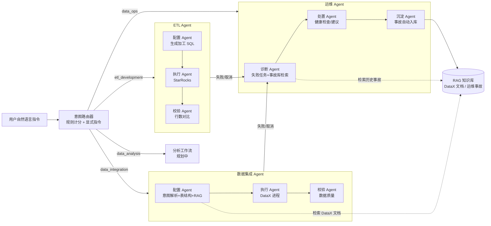

# 数据集成多 Agent 协作系统

基于 LangChain + LangGraph 构建的智能化数据集成系统，通过自然语言指令自动生成 DataX 配置、执行同步任务并进行数据校验。


## 核心特性

- **自然语言交互**：用户通过自然语言描述数据同步需求
- **智能配置生成**：基于 RAG 检索 DataX 官方文档，生成精准配置
- **全链路自动化**：规划、执行、校验全流程无需人工干预
- **多数据源支持**：MySQL、MongoDB、Elasticsearch
- **多 Agent 协作**：集成失败自动交运维 Agent 诊断，事故自动沉淀为知识

## 系统架构



## 技术栈

- **核心框架**：LangChain、LangGraph
- **底层引擎**：DataX
- **检索增强**：基于 Elasticsearch 的 RAG 系统（复用现有资产）

## 快速开始

### 1. 安装依赖

```bash
pip install -r requirements.txt
```

### 2. 配置环境变量

复制 `.env.example` 为 `.env` 并编辑：

```bash
cp .env.example .env
```

### 3. 运行系统

```bash
python -m src.main
```

也可以通过命令行参数指定同步指令：

```bash
python -m src.main "把 MySQL 的 src_user 表同步到 ES 的 src_user_index 索引"
```

### 4. 启动 Web API

```bash
python -m src.api
```

- `POST /sync`：提交同步指令，返回 task_id（异步执行，可用 `/tasks/{task_id}` 查询状态）
- `GET /tasks`：任务历史
- `GET /tasks/{task_id}/logs`：任务日志
- `POST /tasks/{task_id}/retry`：重试已失败/取消的任务（以相同指令新建任务）
- `POST /tasks/{task_id}/cancel`：取消运行中的任务（会终止 DataX 子进程）
- `GET /health`：健康检查

### 5. 运行测试

```bash
pytest
```

测试覆盖配置后处理、数据源标识符校验、DataX 执行、任务状态流转、敏感信息脱敏和 Web API。
全部测试离线可跑（mock DataX、打桩数据库连接），无需真实数据库/ES/LLM，
CI（GitHub Actions）在 Ubuntu / Windows 双平台自动执行。

### 6. 运维诊断示例

```bash
# 查看失败任务
curl http://localhost:8000/tasks

# 对失败任务做故障诊断（自动沉淀事故记录到知识库）
curl -X POST http://localhost:8000/ops/diagnose \
  -H "Content-Type: application/json" \
  -d '{"task_id": "<失败任务的 task_id>"}'
```

## 开源到 GitHub 前

1. 复制 `.env.example` 为 `.env` 并填入本机配置（`.env` 已被 `.gitignore` 排除）
2. 确认没有真实密钥入库：`rg "sk-|tp-|lsv2_" . --glob "!.env"`
3. 修改 README 顶部 CI 徽章中的用户名，推送后徽章自动生效
4. 事故知识库种子（`data/ops_incidents/incidents.jsonl`）与 MyRag 语料
   为个人实战数据，可按需保留或清空后重新沉淀

## 生产部署注意事项

- 所有敏感配置（数据库密码、LLM API Key）只放在 `.env` 中，代码中不再有默认密钥；请勿将 `.env` 提交到版本库
- 任务记录落库前会自动对密码、密钥等字段脱敏
- DataX 执行默认超时 1 小时（`DATAX_TIMEOUT`，秒），超时自动终止进程，避免任务挂死
- 取消/超时按**进程树**终止，不残留子进程：Windows 用 `taskkill /PID <pid> /T /F`
  递归杀进程树，POSIX 用 `killpg`（`Popen(start_new_session=True)`）；
  终止后有限等待退出防僵尸，cancel 事件在所有路径（含 Popen 失败）都会清理
- 表名、列名等标识符经过白名单校验，防止 SQL 注入
- SQLite 状态库开启 WAL 模式与 busy_timeout，支持并发访问；多实例场景可切换 `STATE_STORE_TYPE=mysql`
- 熔断器（LLM / DataX / RAG）在连续失败后自动打开，配合指数退避重试，保护下游服务

## MongoDB 同步注意事项（已内置处理）

- `address` 必须是字符串列表（`["127.0.0.1:27017"]`），不是嵌套数组
- mongo 插件对字段类型严格校验（`long`/`string`/`date`/`bool` 等），
  系统会按源表结构自动重建列类型，覆盖 LLM 猜测的错误类型
- `writeMode` 必须是 JSON 对象（`{"isReplace":"true","replaceKey":"id"}`），字符串形式会导致插件解析失败
- MongoDB 源不支持分片，系统会自动把 `channel` 强制为 1，避免多通道重复写入
- 源数据主键重复时（如测试集合 `conn_check` 全是 id=1），同步到主键表会报唯一键冲突，属于数据质量问题

## StarRocks（Doris）数仓接入

StarRocks / Doris 的 FE 兼容 MySQL 协议，Agent 可直接把它们作为目标库：

- 配置 `STARROCKS_HOST/PORT/USERNAME/PASSWORD/DATABASE`（默认 `127.0.0.1:9030`）
- 目标类型识别：`StarRocks` / `SR` 均归一化为 `starrocks`
- 写入方式：统一降级为 `mysqlwriter` 走 FE 的 MySQL 协议（9030），
  不依赖 Stream Load 直连 BE，规避容器网络下 BE 内网 IP 不可达问题（个人项目数据量下足够）
- 已内置的防御：`writeMode` 强制 `insert`（StarRocks 不支持 REPLACE/UPDATE）、
  清空 LLM 生成的 `preSql/postSql`（建表/清表 DDL 不可靠且有风险）、
  连接表名强制使用目标表
- 表结构获取与数据校验复用 MySQL 协议分支（DESCRIBE / COUNT / COUNT DISTINCT 均兼容）

示例：`python -m src.main "把 MySQL 的 src_user 表同步到 StarRocks 的 src_user_sr 表"`

## 增量同步

指令中带"增量"（如"增量同步 MySQL 的 t 表到 ES"）即开启增量模式：

- 自动检测增量字段（优先 `update_time`/`updated_at` 类，回退到自增 `id`）
- 自动读取上次成功任务的水位（`last_value`），无水位时默认最近 7 天窗口
- 同步完成后自动把源表增量字段的最大值写回任务记录，作为下次水位
- 增量水位按"源表 + 目标表 + 增量字段"维度保存，重复指令可自动续传

## Agent 扩展骨架

- Agent 注册表：`@register_agent(task_type, name)` + `BaseAgent`，
  工作流按 `task_type` 实例化步骤 Agent，新增任务类型无需改核心
- 工具注册表：`@register_tool(name)` + `call_tool(name, **kwargs)`，
  后续 ETL/运维/分析 Agent 可直接复用现有工具
- 统一 LLM 层：`src/utils/llm.py` 的 `get_llm()` 提供共享实例，
  统一管理 API Key 校验、超时与重试

## 意图路由（MVP：基于规则）

`src/intent_router.py` 把自然语言指令路由到对应 Agent 任务类型：

- 规则计分：`data_integration` / `etl_development` / `data_ops` / `data_analysis`
  各自维护关键词表，命中词数最多者胜出
- 显式指令优先：`/etl`、`@ops`、`#analysis` 直接指定任务类型
- 否定词过滤："不要同步"不会误命中同步规则
- 平局判定为模糊指令，要求显式指定
- LLM 兜底可选（`use_llm_fallback=True`），默认关闭

API：

- `POST /route`：`{"query": "..."}` 返回 `task_type / confidence / matched_keywords / source`
- `POST /sync`：内部先路由，非数据集成任务返回 422 并说明识别结果

新增 Agent 时只需：注册表加任务类型 + `router.register_rule(task_type, keywords)`。

## ETL（数据开发）Agent

SQL 型 MVP：指令中带"加工/清洗/聚合"（或 `/etl`）即路由到 `etl_development`：

- 两段式 LLM：先解析意图（`ETLIntent`），再注入源表结构生成加工 SQL（`ETLPlan`）
- SQL 安全校验（`src/tools/sql_validator.py`）：只允许 `INSERT INTO ... SELECT`，
  拦截 DROP/DELETE/TRUNCATE/ALTER/UPDATE/多语句/注释，执行前二次校验
- 执行：StarRocks FE MySQL 协议（9030），行数校验后完成
- 示例：`python -m src.main "把 src_user_sr 加工到 dwd_user_sr"`

## 多表批量同步

- `POST /sync/batch`：`{"query": "...", "tables": ["t1","t2"]}` 批量同步
- 每张表一个子任务（`parent_task_id`），整体构成一个 pipeline（`pipeline_id`）
- 支持部分失败：失败表单独标记，pipeline 汇总为 failed
- 顺序执行保证稳定，依赖排序（`build_execution_order`）预留为并行增强

## 结构化输出

- `src/schemas.py`：Pydantic 模型（`SyncIntent` / `ETLIntent` / `ETLPlan`）统一约束 LLM 输出
- 字段缺失自动补默认值，类型错误触发降级（fallback 意图），
  根治"LLM 编造字段/密码/列名"类问题

## 轻量监控页面

- `GET /ui`：内置监控 dashboard（零外部依赖，纯 HTML/JS）
- 展示任务列表、状态汇总、耗时、错误，点击任务查看日志，10 秒自动刷新

## 并发控制

- `MAX_CONCURRENT_TASKS`（默认 2）：全局信号量限制同时执行的任务数，
  避免多个任务同时抢占 DataX/数据库资源

## 人工审批门禁（上线安全闸）

数据集成 / ETL 任务生成配置后**不会立即执行**，而是挂起在
`pending_approval` 状态等待人工确认——确认的对象就是即将执行的内容
（DataX 配置 / ETL SQL）：

- `POST /sync` 提交任务 → 配置生成 → 状态 `pending_approval`
- `POST /tasks/{id}/approve`：审批通过，才执行 DataX / ETL SQL 并校验
- `POST /tasks/{id}/reject`：拒绝执行，任务取消（`人工拒绝执行`）
- 待审批任务也可直接取消；重试被拒绝的任务会再次进入待审批
- 配置（含 ETL SQL）在审批前已落库，审批时原样恢复执行，保证所见即所执行
- `GET /ui` 监控页有"待审批"卡片和通过/拒绝按钮
- 运维诊断（data_ops）无副作用，不经过门禁；`APPROVAL_GATE=false` 可全局关闭

## 企业级控制

- **审计日志**：`GET /audit` 查询谁在什么时候批准/拒绝/取消/重试了什么任务；
  审批记录包含配置指纹（DataX 配置/ETL SQL 的 sha256 前 16 位），
  可验证"批准的内容"未被篡改；API 可用 `X-Operator` 头标记操作人
- **API Token 鉴权**（可选）：配置 `API_TOKEN` 后，除
  `/health` `/ui` `/metrics` 外所有接口需 `Authorization: Bearer <token>`
  或 `X-API-Token` 头；留空则保持本机直连
- **Prometheus 指标**：`GET /metrics` 输出任务状态计数
  （`dataagent_tasks_total{status=...}`），可接入 Grafana/告警

## LangSmith 追踪（可选）

代码已接入 LangSmith：只要在 `.env` 配置 `LANGCHAIN_API_KEY`，
LangGraph 每个节点的 LLM 调用（prompt、响应、耗时、成本）会自动上报，
可在 [smith.langchain.com](https://smith.langchain.com) 查看完整执行链路。

- 未配置 API Key 时完全离线，零影响
- `LANGCHAIN_TRACING_V2=false` 可随时显式关闭
- 默认项目名 `dataagent`，可用 `LANGCHAIN_PROJECT` 覆盖
- 业务步骤同样进入 trace（`src/utils/tracing.py` 的 `trace_step` 装饰器）：
  `data_integration_task`（任务级）→ `task_create` / `datax_execute` / `data_quality_validation` / `task_complete`
- 输入输出自动脱敏（数据库密码等不会上传）

## DataX 官方知识库（RAG）

Agent 配置阶段会检索 DataX 官方文档 + 本项目踩坑经验，用于生成更准确的配置：

- **语料来源**：DataX 官方仓库（GitHub / Gitee 镜像）各插件 `doc/*.md` +
  顶层文档（README/userGuid/introduction/dataxPluginDev），
  由 `scripts/build_datax_corpus.py` 清洗为中英双语结构化 JSONL
  （中文说明 + 英文参数名/JSON 键 + 配置样例，解决中文 embedding 匹配英文配置的问题）
- **踩坑经验**：`datax_experience/*`（mongo address 数组、mysqlwriter jdbcUrl、
  ES 类型映射、StarRocks 两种写入方式、增量同步水位等），与官方文档互补
- **collection 隔离**：灌库到 MyRag 独立索引 `idx_datax_docs`，
  与周报（`rag`）等其它知识库互不污染；MyRag 侧新增
  `config/collections/datax_docs.json`，`indexing.dedup_enabled=false`
  （官方文档段落高度同构，语义去重会误删有效片段）
- **检索零 LLM 依赖**：`src/tools/rag_tool.py` 走 BM25 + 向量 + RRF 纯召回，
  显式传原始 query 跳过 LLM 改写，快且可离线；Agent 侧自带 LLM 可自行改写
- **一键灌库**：
  ```bash
  python scripts/ingest_datax_docs.py              # 全量重建
  python scripts/ingest_datax_docs.py --no-rebuild # 增量追加（内容哈希去重）
  ```
- 环境变量 `RAG_COLLECTION`（默认 `datax_docs`）可切换知识库；
  collection 不存在时自动降级为 MyRag 默认索引，不阻断 Agent

## 运维事故知识库（Ops Incident KB）

面向未来的运维 Agent 的工作记忆：排查/修复过程中把问题、影响、解决
动态写入知识库，下次遇到同类问题可检索复用。

- **事故存储**（源事实）：`data/ops_incidents/incidents.jsonl`（每行一条记录），
  字段：`incident_id / title / symptom / impact / root_cause / solution /
  component / severity / status / keywords / source`
- **动态写入**（Agent 可调用）：
  ```python
  add_ops_incident({...}, auto_ingest=True)   # 写入/修正记录，可选立即增量灌库
  ```
  - 按 `incident_id` upsert（记录可修正，内容哈希变化自动重建对应 chunk）
  - 字段白名单 + 必填校验 + severity/status 枚举归一化
  - 存储写入用临时文件原子替换，避免写一半损坏
- **检索**：`search_ops_knowledge(query)` 走独立索引 `idx_ops_incident`
  （与 DataX 知识库 `idx_datax_docs`、周报 `rag` 完全隔离）
- **一键灌库**：
  ```bash
  python scripts/ingest_ops_docs.py            # 增量
  python scripts/ingest_ops_docs.py --rebuild  # 全量重建
  ```
- 已内置 6 条本项目实战事故种子（StarRocks 容器网络、MongoDB 多通道重复、
  DataX 超时挂死、ES cleanup 风险、LangSmith 离线等）
- 已注册工具：`add_ops_incident` / `search_ops_knowledge` / `ingest_ops_knowledge`，
  未来运维 Agent 可直接按名调用

## 运维 Agent（data_ops）

对失败/取消的任务做故障诊断，并把诊断结果沉淀为事故知识（知识库自动增长闭环）：

- **诊断**：收集任务错误 + 日志尾部 → 检索 `ops_incident` 事故库 → LLM 生成
  `{root_cause, impact, solution_steps, related_incidents, confidence}`，
  LLM/RAG 不可用时自动降级为规则兜底，链路不中断
- **处置**：组件健康检查（MySQL/MongoDB/ES/StarRocks/DataX，只读短超时）；
  指令含"重试"时实际重试、含"清理"时终止 DataX 进程树，否则只给建议（安全第一）
- **沉淀**：自动生成事故记录（`OPS_AUTO_RECORD=false` 可关闭），
  同标题未解决事故自动去重；记录写入后增量灌库立即可检索
- **API**：`POST /ops/diagnose {"task_id": "..."}` 或自然语言
  `python -m src.main "诊断任务 <task_id>"` / `"帮我排查故障"`
- 已注册工具：`check_component_health` / `retry_failed_task` / `kill_datax_process_tree`
- 进程树终止（Windows `taskkill /T` / POSIX `killpg`）保证取消/超时/清理不残留 Java 子进程

## 路线图

- [x] 数据集成 Agent（配置/执行/校验、增量、批量、取消重试）
- [x] ETL Agent（StarRocks SQL 加工）
- [x] 运维 Agent（故障诊断 + 事故知识沉淀）
- [x] RAG 知识库（DataX 官方文档 / 运维事故，collection 隔离）
- [ ] 数据分析 Agent（LLM → SQL 查询，待 dwd 层数据积累）
- [ ] 内置轻量定时调度（不引入 DolphinScheduler）

## 项目结构

```
src/
├── agents/          # 多 Agent 实现
├── tools/           # 工具封装
├── state/           # 状态定义
├── workflow/        # LangGraph 工作流
├── config/          # 配置文件
├── utils/           # 日志、重试熔断、安全脱敏
└── api.py           # FastAPI Web 服务
└── utils/           # 工具函数
```

## 配置说明

### 环境变量

- `DATAX_HOME`：DataX 安装目录
- `MYSQL_*`：MySQL 连接配置
- `MONGODB_*`：MongoDB 连接配置
- `ES_*`：Elasticsearch 连接配置
- `RAG_PROJECT_PATH`：现有 RAG 项目路径
- `RAG_COLLECTION`：RAG 知识库 collection（默认 `datax_docs`）
- `OPS_INCIDENT_STORE`：运维事故存储路径（默认 `data/ops_incidents/incidents.jsonl`）

### 数据库支持

| 数据库 | 支持状态 | 说明 |
|--------|----------|------|
| MySQL | ✅ 支持 | 作为源端和目标端 |
| MongoDB | ✅ 支持 | 作为源端和目标端 |
| Elasticsearch | ✅ 支持 | 作为源端和目标端 |

## 使用示例

### 示例 1：MySQL 同步到 ES

```
把 MySQL 的 user 表同步到 ES
```

### 示例 2：MongoDB 同步到 ES

```
将 MongoDB 的 orders 集合同步到 Elasticsearch
```

### 示例 3：指定表名

```
同步 MySQL 的 product 表到 ES 的 products 索引
```

## 开发指南

### 添加新的数据库支持

1. 在 `src/tools/db_tool.py` 中添加新的数据库连接方法
2. 在 `src/tools/validation_tool.py` 中添加对应的校验逻辑
3. 更新配置文件和文档

### 自定义 Agent 行为

修改 `src/agents/` 目录下对应的 Agent 文件。

## 故障排除

### 常见问题

1. **DataX 执行失败**：检查 DataX 安装路径和配置文件
2. **数据库连接失败**：检查连接配置和服务状态
3. **RAG 检索失败**：确认 RAG 系统正在运行

### 日志查看

日志文件位于 `F:\dataagent\logs\app.log`。

## 文档

- [部署指南](DEPLOY.md)
- [API 文档](docs/api.md)（待编写）

## 许可证

MIT License
