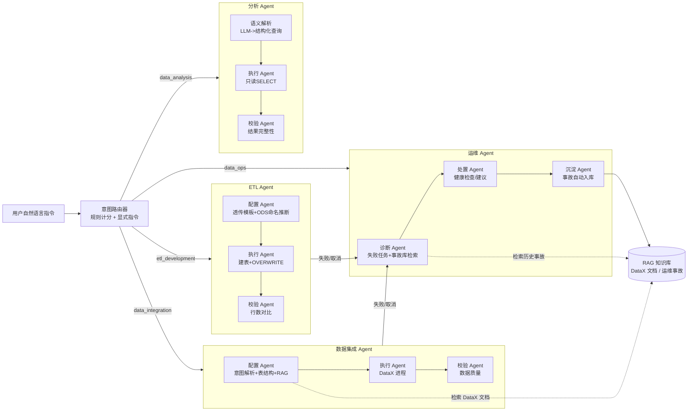

# 数仓多 Agent 协作平台

基于 LangChain + LangGraph 构建的智能化数仓多 Agent 协作平台，
通过自然语言指令完成数据集成、ETL 加工、运维诊断等数仓工作流。


## 核心特性

- **自然语言交互**：用户通过自然语言描述数据同步需求
- **智能配置生成**：基于 RAG 检索 DataX 官方文档，生成精准配置
- **人工审批门禁**：写操作（集成/ETL）生成配置后挂起，人工确认才执行
- **多数据源支持**：MySQL、MongoDB、Elasticsearch
- **源表歧义消除**：跨库按表名/表注释发现候选（`discover_tables`），
  唯一命中自动采用；多个候选或找不到时强制用户明确 `库.表`，
  杜绝"猜错表名一路跑到执行才失败"
- **ETL 确定性透传**：ODS → DWD 走三类固定模板（纯透传 / 字段映射 / 枚举码值映射），
  按 ODS 命名规范（`ods_x` / `ods_x_day_inc` / `ods_x_day_snapshot`）自动推断表与分区，
  `INSERT OVERWRITE PARTITION` 幂等；目标表缺失自动生成 DDL（需管理账号，见 `.env`）
- **轻量语义层 + 数据分析**：YAML 定义指标/维度与聚合口径（Supersonic 风格），
  LLM 只输出结构化语义查询，SQL 由代码确定性生成（SELECT-only + 超时 + LIMIT 防御），
  结果附带**口径说明卡片**（数据来源/指标公式/维度/过滤/粒度，与执行 SQL 同源、LLM 不参与编造），
  可选 LLM 中文总结；只读查询无需人工审批
- **语义层可视化配置**：`/ui/semantic` 页增删改指标/维度，服务端严格校验后写回 `catalog.yaml`
  并热重载；支持**从物理表一键导入草稿**（读 information_schema 自动分类指标/维度，人工补口径）；
  同页只读查看各 Agent 的 system prompt（集中在 `src/agents/prompts.py`）
- **多 Agent 协作**：集成失败自动交运维 Agent 诊断，事故自动沉淀为知识

## 系统架构



## 技术栈

- **核心框架**：LangChain、LangGraph
- **底层引擎**：DataX
- **检索增强**：基于 Elasticsearch 的 RAG 系统（复用现有资产）

## 快速开始

### 1. 安装依赖

```bash
pip install -r requirements.txt
# 或开发模式（含测试依赖）：
pip install -e ".[dev]"
# 如需向量检索（ops_incident）：
pip install -e ".[rag]"
```

### 2. 配置环境变量

复制 `.env.example` 为 `.env` 并编辑：

```bash
cp .env.example .env
```

### 3. 运行系统

```bash
python -m src.main
```

也可以通过命令行参数指定同步指令：

```bash
python -m src.main "把 MySQL 的 src_user 表同步到 ES 的 src_user_index 索引"
```

### 4. 启动 Web API

```bash
python -m src.api
```

- `POST /sync`：提交同步指令，返回 task_id（异步执行，可用 `/tasks/{task_id}` 查询状态）
- `GET /tasks`：任务历史
- `GET /tasks/{task_id}/logs`：任务日志
- `POST /tasks/{task_id}/retry`：重试已失败/取消的任务（以相同指令新建任务）
- `POST /tasks/{task_id}/cancel`：取消运行中的任务（会终止 DataX 子进程）
- `GET /health`：健康检查

完整 API 文档见 [docs/API.md](docs/API.md)（含请求/响应示例与状态码约定），
交互式文档可直接访问 `http://localhost:8000/docs`（Swagger UI，自动同步代码）。

Web 界面（推荐从单页外壳进入，浏览器访问根路径 `/` 自动跳转）：
- `GET /app`：**单页工作台**——顶部全局导航 + iframe 保活，在
  全链路监控 / 智能对话 / 同步向导 / 语义层配置之间切换不整页跳转，主题全局联动。
- `GET /chat`：自然语言对话（集成 / ETL / 运维 / 分析四类任务，左侧历史）。
- `GET /ui`：全链路监控（任务 / 管道 / 审计 / 健康 / 数据源 / **⏰定时调度** + 亮暗主题）。

### Docker 一键起服务

```bash
# 数据库（MySQL/StarRocks/Mongo/ES）跑在宿主机上，容器通过 host.docker.internal 访问
docker compose up --build
# 打开 http://localhost:8000/app
```

镜像默认不含 DataX（DataX 装在宿主机）。平台 UI / API / 语义层 / 运维诊断开箱可用；
若要在容器内执行真实数据同步，把宿主机 DataX 目录挂载进容器并设置 `DATAX_HOME`
（见 `docker-compose.yml` 注释）。

### 5. 运行测试

```bash
pytest                          # 单元/集成测试（离线，mock DataX/数据库/LLM）
python scripts/eval_gate.py     # 发版前一键门禁：golden 回归(阻塞)+轨迹巡检/体检(诊断)
python scripts/eval_gate.py --llm                       # 完整门禁：再加真实 LLM 质量评测(阻塞)
python scripts/eval_golden.py   # 第①层：确定性回归（不调 LLM/不连库），CI 门禁
python scripts/eval_trajectory.py  # 在线轨迹正确性巡检（读 tasks.db，门禁/状态机顺序）
python scripts/lint_traces.py      # 在线轨迹健康体检（重复步骤/报错、空转、耗时离群）
python scripts/eval_llm_quality.py            # 第②层：LLM 开放点质量评测（发版前手动跑）
python scripts/eval_llm_quality.py --judge    # 追加 LLM 主观打分（额外消耗 token）
```

评测按「确定性 vs 开放性」分两层：

- **第①层 确定性回归**（`eval_golden.py`，进 CI）：意图路由、配置归一化、Pydantic
  强校验、ETL SQL、运维事故版本化、轨迹顺序等**规则可判定**的行为，精确断言，零 LLM/网络。
- **第②层 LLM 质量评测**（`eval_llm_quality.py`，发版前跑）：对三个开放 LLM 点
  （意图解析、问数语义解析、运维诊断）用冻结 golden case 真实调用 LLM 打分。
  评分**以结构化断言为主**（字段是否抽对、指标/维度是否命中语义层、只读 SQL 是否
  合法、根因是否点到关键词），`--judge` 可选 LLM-as-judge 对主观质量（根因/摘要好不好）
  打 1-5 分；同时统计 token/延迟成本。case 见 `evals/llm_cases/`。

测试覆盖配置后处理、数据源标识符校验、DataX 执行、任务状态流转、敏感信息脱敏和 Web API。
全部单测离线可跑（mock DataX、打桩数据库连接），无需真实数据库/ES/LLM，
CI（GitHub Actions）在 Ubuntu / Windows 双平台自动执行。

**评测数据飞轮（bad case 闭环）**：失败任务回流为素材，分诊后用「修复后的当前代码」
重放生成 golden 草稿，人工确认即固化为回归用例，防止同类问题复发：

```bash
curl -X POST localhost:8010/tasks/<task_id>/badcase -d '{"note":"现象"}'  # 回流素材
python scripts/triage_badcase.py list                 # 待分诊素材
python scripts/triage_badcase.py promote <task_id>    # 重放当前代码 -> 生成 golden 草稿
python scripts/triage_badcase.py reject  <task_id> --reason "非缺陷"  # 丢弃噪声
python scripts/triage_badcase.py status               # 分诊进度
```

晋升的草稿带 `needs_review: true`，**不参与评测打分**；人工核对 `expect` 后删掉该标记
即正式纳入 `evals/llm_cases/` 回归集（人在环里，避免把未确认输出固化成标准）。

**Good case 闭环（成功任务 -> 防回归 / 防模型漂移）**：失败任务靠 bad case *发现新问题*，
成功任务则沉淀为 *防漂移基线*。成功任务落库的 `parsed_intent` / `analysis_sql` 本身就是
经过数据校验的正确产出，因此晋升时**零 LLM 成本**——直接快照推导 `expect`，无需重放：

```bash
curl -X POST localhost:8010/tasks/<task_id>/goodcase -d '{"note":"基线"}'  # 仅成功任务可回流
python scripts/triage_badcase.py list-good                  # 待晋升的成功素材
python scripts/triage_badcase.py promote-good <task_id>     # 快照零成本生成 golden 草稿
python scripts/triage_badcase.py status                     # good/bad 分类进度
```

素材写 `evals/backlog/good_cases.jsonl`（已 gitignore）；晋升草稿同样带 `needs_review`，
人工核对后纳入回归集。此后每次 `eval_llm_quality.py` 都会重放这些 query，一旦模型升级/
切换后意图解析或问数语义偏离已验证的正确行为，评测立即红灯——这就是个人项目里最轻量的
「模型漂移检测」。

## MCP Server（模型上下文协议）

把平台能力暴露为标准 MCP 工具，任何支持 MCP 的客户端
（Claude Desktop、Cursor、自建 Agent 等）都能直接调用：

```bash
python -m src.mcp_server                                    # STDIO（默认，推荐桌面客户端）
python -m src.mcp_server --transport sse --port 9000        # SSE over HTTP
```

工具清单：

| 工具 | 说明 | 同步/异步 |
|------|------|-----------|
| `submit_task(query)` | 自然语言提交集成/ETL/运维/分析任务（写任务进人工审批） | 异步返回 task_id |
| `get_task(task_id)` / `list_tasks` | 任务状态与结果查询 | 同步 |
| `approve_task` / `reject_task` | 人工审批门禁（写任务必须确认后才执行） | 同步 |
| `analyze(query)` | 语义层只读分析，返回结果行 + LLM 中文总结 | 同步 |
| `list_catalog()` | 语义层已注册指标/维度清单 | 同步 |
| `submit_etl(...)` | 确定性 ODS→DWD 透传（按参数构造指令，审批后执行） | 异步 |
| `diagnose_task(task_id)` | 运维诊断：根因 + 知识库检索 + 处置 + 自动沉淀 | 同步 |
| `search_knowledge(query)` | 运维事故知识库检索 | 同步 |
| `list_datasources()` / `discover_tables()` | 数据源与跨库表发现 | 同步 |

Claude Desktop 配置示例（`claude_desktop_config.json`）：

```json
{
  "mcpServers": {
    "dataagent": {
      "command": "F:\\Python\\python3.11\\python.exe",
      "args": ["-m", "src.mcp_server"],
      "cwd": "F:\\dataagent"
    }
  }
}
```

设计要点：只读能力（分析/知识库/数据源）同步返回；写能力（集成/ETL）异步提交
并强制走人工审批门禁，审批通过前不落库执行，保证"上线前人工确认"的原则。

### 6. 运维诊断示例

```bash
# 查看失败任务
curl http://localhost:8000/tasks

# 对失败任务做故障诊断（自动沉淀事故记录到知识库）
curl -X POST http://localhost:8000/ops/diagnose \
  -H "Content-Type: application/json" \
  -d '{"task_id": "<失败任务的 task_id>"}'
```

## 开源到 GitHub 前

1. 复制 `.env.example` 为 `.env` 并填入本机配置（`.env` 已被 `.gitignore` 排除）
2. 确认没有真实密钥入库：`rg "sk-|tp-|lsv2_" . --glob "!.env"`
3. 修改 README 顶部 CI 徽章中的用户名，推送后徽章自动生效
4. 事故知识库种子（`data/ops_incidents/incidents.jsonl`）为个人实战数据，
   可按需保留或清空后重新沉淀

## 生产部署注意事项

- 所有敏感配置（数据库密码、LLM API Key）只放在 `.env` 中，代码中不再有默认密钥；请勿将 `.env` 提交到版本库
- 任务记录落库前会自动对密码、密钥等字段脱敏
- DataX 执行默认超时 1 小时（`DATAX_TIMEOUT`，秒），超时自动终止进程，避免任务挂死
- 取消/超时按**进程树**终止，不残留子进程：Windows 用 `taskkill /PID <pid> /T /F`
  递归杀进程树，POSIX 用 `killpg`（`Popen(start_new_session=True)`）；
  终止后有限等待退出防僵尸，cancel 事件在所有路径（含 Popen 失败）都会清理
- 表名、列名等标识符经过白名单校验，防止 SQL 注入
- SQLite 状态库开启 WAL 模式与 busy_timeout，支持并发访问；多实例场景可切换 `STATE_STORE_TYPE=mysql`
- 熔断器（LLM / DataX / RAG）在连续失败后自动打开，配合指数退避重试，保护下游服务

## MongoDB 同步注意事项（已内置处理）

- `address` 必须是字符串列表（`["127.0.0.1:27017"]`），不是嵌套数组
- mongo 插件对字段类型严格校验（`long`/`string`/`date`/`bool` 等），
  系统会按源表结构自动重建列类型，覆盖 LLM 猜测的错误类型
- `writeMode` 必须是 JSON 对象（`{"isReplace":"true","replaceKey":"id"}`），字符串形式会导致插件解析失败
- MongoDB 源不支持分片，系统会自动把 `channel` 强制为 1，避免多通道重复写入
- 源数据主键重复时（如测试集合 `conn_check` 全是 id=1），同步到主键表会报唯一键冲突，属于数据质量问题

## StarRocks（Doris）数仓接入

StarRocks / Doris 的 FE 兼容 MySQL 协议，Agent 可直接把它们作为目标库：

- 配置 `STARROCKS_HOST/PORT/USERNAME/PASSWORD/DATABASE`（StarRocks 4.0 容器 FE MySQL 协议映射到宿主机 `127.0.0.1:9031`，容器内 root 默认无密码）
- 目标类型识别：`StarRocks` / `SR` 均归一化为 `starrocks`
- 写入方式：统一降级为 `mysqlwriter` 走 FE 的 MySQL 协议（宿主机 9031），
  不依赖 Stream Load 直连 BE，规避容器网络下 BE 内网 IP 不可达问题（个人项目数据量下足够）
- 已内置的防御：`writeMode` 强制 `insert`（StarRocks 不支持 REPLACE/UPDATE）、
  清空 LLM 生成的 `preSql/postSql`（建表/清表 DDL 不可靠且有风险）、
  连接表名强制使用目标表
- 表结构获取与数据校验复用 MySQL 协议分支（DESCRIBE / COUNT / COUNT DISTINCT 均兼容）

示例：`python -m src.main "把 MySQL 的 src_user 表同步到 StarRocks 的 src_user_sr 表"`

## 增量同步

指令中带"增量"（如"增量同步 MySQL 的 t 表到 ES"）即开启增量模式：

- 自动检测增量字段（优先 `update_time`/`updated_at` 类，回退到自增 `id`）
- 自动读取上次成功任务的水位（`last_value`），无水位时默认最近 7 天窗口
- 同步完成后自动把源表增量字段的最大值写回任务记录，作为下次水位
- 增量水位按"源表 + 目标表 + 增量字段"维度保存，重复指令可自动续传

## Agent 扩展骨架

- Agent 注册表：`@register_agent(task_type, name)` + `BaseAgent`，
  工作流按 `task_type` 实例化步骤 Agent，新增任务类型无需改核心
- 工具注册表：`@register_tool(name)` + `call_tool(name, **kwargs)`，
  后续 ETL/运维/分析 Agent 可直接复用现有工具
- 统一 LLM 层：`src/utils/llm.py` 的 `get_llm()` 提供共享实例，
  统一管理 API Key 校验、超时与重试；按任务类型可覆盖模型
  （`.env` 中配置 `AGENT_<TASK_TYPE>_MODEL`，缺省全部走 `LLM_MODEL`），
  新增 Agent 时只需在 `config.AGENT_MODELS` 注册一项

## 意图路由（MVP：基于规则）

`src/intent_router.py` 把自然语言指令路由到对应 Agent 任务类型：

- 规则计分：`data_integration` / `etl_development` / `data_ops` / `data_analysis`
  各自维护关键词表，命中词数最多者胜出
- 显式指令优先：`/etl`、`@ops`、`#analysis` 直接指定任务类型
- 否定词过滤："不要同步"不会误命中同步规则
- 平局判定为模糊指令，要求显式指定
- LLM 兜底可选（`use_llm_fallback=True`），默认关闭

API：

- `POST /route`：`{"query": "..."}` 返回 `task_type / confidence / matched_keywords / source`
- `POST /sync`：内部先路由，非数据集成任务返回 422 并说明识别结果

新增 Agent 时只需：注册表加任务类型 + `router.register_rule(task_type, keywords)`。

## ETL（数据开发）Agent

SQL 型 MVP：指令中带"加工/清洗/聚合"（或 `/etl`）即路由到 `etl_development`：

- 两段式 LLM：先解析意图（`ETLIntent`），再注入源表结构生成加工 SQL（`ETLPlan`）
- SQL 安全校验（`src/tools/sql_validator.py`）：只允许 `INSERT INTO ... SELECT`，
  拦截 DROP/DELETE/TRUNCATE/ALTER/UPDATE/多语句/注释，执行前二次校验
- 执行：StarRocks 4.0 FE MySQL 协议（宿主机 9031），行数校验后完成
- 示例：`python -m src.main "把 src_user_sr 加工到 dwd_user_sr"`

## 多表批量同步

- `POST /sync/batch`：`{"query": "...", "tables": ["t1","t2"]}` 批量同步
- 每张表一个子任务（`parent_task_id`），整体构成一个 pipeline（`pipeline_id`）
- 支持部分失败：失败表单独标记，pipeline 汇总为 failed
- 顺序执行保证稳定，依赖排序（`build_execution_order`）预留为并行增强

## 结构化输出

- `src/schemas.py`：Pydantic 模型（`SyncIntent` / `ETLIntent` / `ETLPlan`）统一约束 LLM 输出
- 字段缺失自动补默认值，类型错误触发降级（fallback 意图），
  根治"LLM 编造字段/密码/列名"类问题

## 全链路监控页面

- `GET /ui`：内置全链路监控 dashboard（零外部依赖，纯 HTML/JS）
- **任务视图**：可点击统计卡片（状态筛选）、筛选工具栏（关键字/状态/类型/时间）、
  表头排序、分页、创建/完成/耗时三时间列、待审批通过/拒绝、失败重试/运维诊断、
  10 秒自动刷新
- **管道视图**：批量任务父子树（pipeline_id 分组）
- **审计视图**：谁在什么时候批准/拒绝/取消了什么任务（含配置指纹）
- **组件健康**：MySQL/MongoDB/ES/StarRocks/DataX 连通性面板
- **数据源管理**：命名连接注册表（同类型可配多个源），新增/编辑/删除、
  保存前测试连接、元数据发现（库/表），密码仅写入不回显；
  `.env` 默认实例之外的自定义源由此管理
- **同步向导**：/ui 数据源页签内"同步向导"——选数据源 → 选库 → 选表 →
  目标端 → 提交；结构化意图直接模板直出（跳过 LLM，确定性、零幻觉），
  自然语言也可用「数据源 XX」指定命名源
- **任务详情**：阶段时间线（配置→审批→执行→校验各阶段耗时）、
  该任务审计记录、错误信息、操作按钮、运维诊断/处置/事故沉淀结果
- **主题**：亮/暗切换（默认跟随系统，手动选择记忆在本地）
- 配置 `API_TOKEN` 后，可在页面右上角填入 token 执行审批/重试等操作

## 交互页面（自然语言入口）

- `GET /chat`：对话式交互页，输入自然语言指令驱动各 Agent
- 提交后**立即返回 task_id 并后台执行**（`POST /chat/submit`），
  前端每 2 秒轮询，对话卡片实时展示：路由识别 → 配置生成 → 待审批 →
  执行 → 校验 的阶段进度
- 待审批任务直接在对话里"通过/拒绝"；失败任务一键"重试/运维诊断"，
  诊断结果（根因 + 处置建议 + 事故沉淀）直接回显在对话中
- 顶部示例 chips 一键填入常用指令（同步 / ETL 加工 / 增量 / 诊断）
- 右上角"全链路监控 ↗"跳转 `/ui` 查看全局视图；"语义层/提示词 ↗"跳转 `/ui/semantic`

## 并发控制

- `MAX_CONCURRENT_TASKS`（默认 2）：全局信号量限制同时执行的任务数，
  避免多个任务同时抢占 DataX/数据库资源

## 人工审批门禁（上线安全闸）

数据集成 / ETL 任务生成配置后**不会立即执行**，而是挂起在
`pending_approval` 状态等待人工确认——确认的对象就是即将执行的内容
（DataX 配置 / ETL SQL）：

- `POST /sync` 提交任务 → 配置生成 → 状态 `pending_approval`
- `POST /tasks/{id}/approve`：审批通过，才执行 DataX / ETL SQL 并校验
- `POST /tasks/{id}/reject`：拒绝执行，任务取消（`人工拒绝执行`）
- 待审批任务也可直接取消；重试被拒绝的任务会再次进入待审批
- 配置（含 ETL SQL）在审批前已落库，审批时原样恢复执行，保证所见即所执行
- `GET /ui` 监控页有"待审批"卡片和通过/拒绝按钮
- 运维诊断（data_ops）无副作用，不经过门禁；`APPROVAL_GATE=false` 可全局关闭

## 定时调度（ODS 无人值守）

数仓的本质是每天定时把 ODS 增量/快照跑起来。平台内置轻量调度，补齐
"chat 触发跑完即走" 之外的**批处理脊柱**：

- **登记即授权**：用户在「⏰ 调度」页登记同步指令与频率（每日定点 / 间隔分钟），
  到点由守护线程自动触发，复用与 chat 完全相同的确定性链路；写操作类任务
  **自动通过审批门禁**（`operator=scheduler` 并写审计），无需人工卡点。
- **零依赖守护线程 + 纯函数到点判定**：不引入 APScheduler——单进程、每日批处理
  场景下 cron/作业持久化/misfire 属过度设计；`is_due(job, now)` 可注入时钟单测。
  需要多进程 / 复杂 cron 时，平滑替换为 APScheduler `BackgroundScheduler` 即可。
- **API**：`GET/POST /schedules`、`POST /schedules/{id}/toggle|run`、`DELETE /schedules/{id}`；
  成功的对话式集成任务可一键「⏰ 加入调度」。
- 环境开关：`SCHEDULER_ENABLED`、`SCHEDULER_TICK_SECONDS`。

## 企业级控制

- **数据源凭据加密落库**：数据源密码用 Fernet（AES-128 + HMAC）对称加密存储，
  密文带 `enc:v1:` 前缀；接口只回 `has_password`，永不回显。主密钥取
  `DATASOURCE_SECRET_KEY`，未配置则在 `state/.secret_key` 自动生成（不入库、不进 git）；
  历史明文启动时一次性迁移，旧值向后兼容。
- **审计日志**：`GET /audit` 查询谁在什么时候批准/拒绝/取消/重试了什么任务；
  审批记录包含配置指纹（DataX 配置/ETL SQL 的 sha256 前 16 位），
  可验证"批准的内容"未被篡改；API 可用 `X-Operator` 头标记操作人
- **决策依据轨迹**（decision_logs）：每个关键决策点结构化落库，回答
  "这一步是规则判定、LLM 推断还是人工操作"。五类 basis：
  `rule`（规则/模板，确定性）、`llm`（模型推断，兜底）、`default`（默认回填）、
  `explicit`（用户显式指令）、`human`（人工审批/编辑，复用审计日志不重复记）；
  evidence 只存关键抽取值并自动脱敏，不存 prompt 原文（那是 LangSmith 的职责）
  - `GET /tasks/{id}/decisions`：机器决策 + 人工动作合并的时间线
  - `GET /metrics/summary` 的 `decisions` 字段按「节点 × basis」聚合，
    可直接算规则覆盖率 / LLM 兜底率，是衡量 Agent 确定性的核心指标
  - chat 卡片与任务详情页有「🧭 决策依据」折叠时间线
- **API Token 鉴权**（可选）：配置 `API_TOKEN` 后，除
  `/health` `/ui` `/metrics` 外所有接口需 `Authorization: Bearer <token>`
  或 `X-API-Token` 头；留空则保持本机直连
- **Prometheus 指标**：`GET /metrics` 输出任务状态计数
  （`dataagent_tasks_total{status=...}`），可接入 Grafana/告警

## LangSmith 追踪（可选）

代码已接入 LangSmith：只要在 `.env` 配置 `LANGCHAIN_API_KEY`，
LangGraph 每个节点的 LLM 调用（prompt、响应、耗时、成本）会自动上报，
可在 [smith.langchain.com](https://smith.langchain.com) 查看完整执行链路。

- 未配置 API Key 时完全离线，零影响
- `LANGCHAIN_TRACING_V2=false` 可随时显式关闭
- 默认项目名 `dataagent`，可用 `LANGCHAIN_PROJECT` 覆盖
- 业务步骤同样进入 trace（`src/utils/tracing.py` 的 `trace_step` 装饰器）：
  `data_integration_task`（任务级）→ `task_create` / `datax_execute` / `data_quality_validation` / `task_complete`
- 输入输出自动脱敏（数据库密码等不会上传）

## DataX 官方知识库（RAG）

Agent 配置阶段会检索 DataX 官方文档 + 本项目踩坑经验，用于生成更准确的配置：

- **语料来源**：DataX 官方仓库（GitHub / Gitee 镜像）各插件 `doc/*.md` +
  顶层文档（README/userGuid/introduction/dataxPluginDev），
  由 `scripts/build_datax_corpus.py` 清洗为中英双语结构化 JSONL
  （中文说明 + 英文参数名/JSON 键 + 配置样例，解决中文 embedding 匹配英文配置的问题）
- **踩坑经验**：`datax_experience/*`（mongo address 数组、mysqlwriter jdbcUrl、
  ES 类型映射、StarRocks 两种写入方式、增量同步水位等），与官方文档互补
- **自包含**：RAG 核心已内嵌为 `src/rag/` 子包（检索 + 灌库），
  不依赖任何外部 RAG 项目；密钥统一由 `.env` 注入
- **collection 隔离**：灌库到独立 ES 索引 `idx_datax_docs`，
  与其它知识库互不污染；collection 配置见
  `src/rag/config/collections/datax_docs.json`，`indexing.dedup_enabled=false`
  （官方文档段落高度同构，语义去重会误删有效片段）
- **模板优先、RAG 兜底**：已知插件对（`get_template` 命中）不查文档，
  快乐路径零 RAG 依赖；仅模板缺失或配置校验失败时才检索
  （`RAG_DOCS_ENABLED` 可整体关闭）
- **检索零 LLM 依赖**：纯召回（BM25 + 向量 + RRF），显式传原始 query
  跳过 LLM 改写，快且可离线；datax_docs 为纯 BM25（语料已含英文关键词行，
  中文 query 匹配英文 JSON 键足够），ops_incident 保留向量召回
- **一键灌库**（首次使用先把 DataX 官方仓库 clone 到 `data/datax_docs/DataX`，
  或用 `--repo <路径>` 指定）：
  ```bash
  python scripts/ingest_datax_docs.py              # 全量重建
  python scripts/ingest_datax_docs.py --no-rebuild # 增量追加（内容哈希去重）
  ```
- 环境变量 `RAG_COLLECTION`（默认 `datax_docs`）可切换知识库；
  collection 不存在时自动降级为默认索引，不阻断 Agent

## 运维事故知识库（Ops Incident KB）

面向未来的运维 Agent 的工作记忆：排查/修复过程中把问题、影响、解决
动态写入知识库，下次遇到同类问题可检索复用。

- **事故存储**（源事实）：`data/ops_incidents/incidents.jsonl`（每行一条记录），
  字段：`incident_id / title / symptom / impact / root_cause / solution /
  component / severity / status / keywords / source`
- **动态写入**（Agent 可调用）：
  ```python
  add_ops_incident({...}, auto_ingest=True)   # 写入/修正记录，可选立即增量灌库
  ```
  - 按 `incident_id` upsert（记录可修正，内容哈希变化自动重建对应 chunk）
  - 字段白名单 + 必填校验 + severity/status 枚举归一化
  - 存储写入用临时文件原子替换，避免写一半损坏
- **检索**：`search_ops_knowledge(query)` 走独立索引 `idx_ops_incident`
  （与 DataX 知识库 `idx_datax_docs`、周报 `rag` 完全隔离）
- **一键灌库**：
  ```bash
  python scripts/ingest_ops_docs.py            # 增量
  python scripts/ingest_ops_docs.py --rebuild  # 全量重建
  ```
- 已内置 6 条本项目实战事故种子（StarRocks 容器网络、MongoDB 多通道重复、
  DataX 超时挂死、ES cleanup 风险、LangSmith 离线等）
- 已注册工具：`add_ops_incident` / `search_ops_knowledge` / `ingest_ops_knowledge`，
  未来运维 Agent 可直接按名调用

## 运维 Agent（data_ops）

对失败/取消的任务做故障诊断，并把诊断结果沉淀为事故知识（知识库自动增长闭环）：

- **诊断**：收集任务错误 + 日志尾部 → 检索 `ops_incident` 事故库 → LLM 生成
  `{root_cause, impact, solution_steps, related_incidents, related_links, confidence}`；
  本地知识库命中不足或用户显式要求（"搜索/查一下"）时触发 **Web 搜索兜底**
  （`WEB_SEARCH_PROVIDER`：duckduckgo/tavily），结果带引用注入诊断，
  发送前自动脱敏 + 熔断 + 超时降级；duckduckgo 为非官方端点（免费但可能限流，
  空结果自动重试一次），生产建议 Tavily；LLM/RAG 不可用时规则兜底，链路不中断
- **处置**：组件健康检查（MySQL/MongoDB/ES/StarRocks/DataX，只读短超时）；
  指令含"重试"时实际重试、含"清理"时终止 DataX 进程树，否则只给建议（安全第一）
- **沉淀**：自动生成事故记录（`OPS_AUTO_RECORD=false` 可关闭），
  **版本化**：同一问题（组件+归一化标题签名）内容变化时升版追加，账本 append-only，
  检索索引只投影最新版，旧方案不会污染诊断；记录写入后增量灌库立即可检索
- **API**：`POST /ops/diagnose {"task_id": "..."}` 或自然语言
  `python -m src.main "诊断任务 <task_id>"` / `"帮我排查故障"`
- 已注册工具：`check_component_health` / `retry_failed_task` /
  `kill_datax_process_tree` / `web_search`
- 进程树终止（Windows `taskkill /T` / POSIX `killpg`）保证取消/超时/清理不残留 Java 子进程

## 路线图

- [x] 数据集成 Agent（配置/执行/校验、增量、批量、取消重试）
- [x] ETL Agent（StarRocks SQL 加工）
- [x] 运维 Agent（故障诊断 + 事故知识沉淀）
- [x] RAG 知识库（DataX 官方文档 / 运维事故，collection 隔离）
- [ ] 数据分析 Agent（LLM → SQL 查询，待 dwd 层数据积累）
- [ ] 内置轻量定时调度（不引入 DolphinScheduler）

## 项目结构

```
src/
├── agents/          # 多 Agent 实现
├── tools/           # 工具封装
├── state/           # 状态定义
├── workflow/        # LangGraph 工作流
├── config/          # 配置文件
├── utils/           # 日志、重试熔断、安全脱敏
└── api.py           # FastAPI Web 服务
└── utils/           # 工具函数
```

## 配置说明

### 环境变量

- `DATAX_HOME`：DataX 安装目录
- `MYSQL_*`：MySQL 连接配置
- `MONGODB_*`：MongoDB 连接配置
- `ES_*`：Elasticsearch 连接配置
- `RAG_COLLECTION`：RAG 知识库 collection（默认 `datax_docs`）
- `SILICONFLOW_API_KEY`：可选，启用 RAG API 精排（留空则用 RRF 融合）
- `OPS_INCIDENT_STORE`：运维事故存储路径（默认 `data/ops_incidents/incidents.jsonl`）

### 数据库支持

| 数据库 | 支持状态 | 说明 |
|--------|----------|------|
| MySQL | ✅ 支持 | 作为源端和目标端 |
| MongoDB | ✅ 支持 | 作为源端和目标端 |
| Elasticsearch | ✅ 支持 | 作为源端和目标端 |

## 使用示例

### 示例 1：MySQL 同步到 ES

```
把 MySQL 的 user 表同步到 ES
```

### 示例 2：MongoDB 同步到 ES

```
将 MongoDB 的 orders 集合同步到 Elasticsearch
```

### 示例 3：指定表名

```
同步 MySQL 的 product 表到 ES 的 products 索引
```

## 开发指南

### 添加新的数据库支持

1. 在 `src/tools/db_tool.py` 中添加新的数据库连接方法
2. 在 `src/tools/validation_tool.py` 中添加对应的校验逻辑
3. 更新配置文件和文档

### 自定义 Agent 行为

修改 `src/agents/` 目录下对应的 Agent 文件。

## 故障排除

### 常见问题

1. **DataX 执行失败**：检查 DataX 安装路径和配置文件
2. **数据库连接失败**：检查连接配置和服务状态
3. **RAG 检索失败**：确认 RAG 系统正在运行

### 日志查看

日志文件位于 `F:\dataagent\logs\app.log`。

## 文档

- [部署指南](DEPLOY.md)
- [API 文档](docs/API.md)

## 许可证

MIT License
