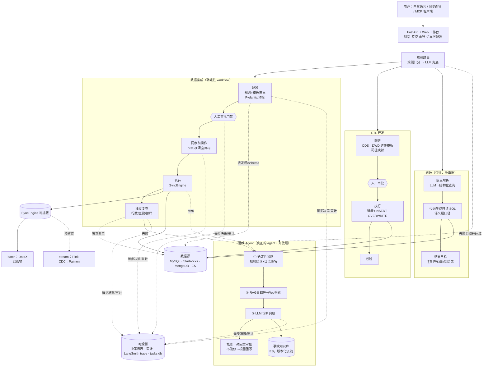

# 数仓多 Agent 协作平台

基于 LangGraph 状态机 + LangChain 的数仓智能体平台：用自然语言完成**数据集成、
ETL 开发、问数、运维诊断**四类数仓工作。设计原则是**确定性优先**——模板与规则
覆盖快乐路径，LLM 只做受限解析与开放题兜底；写操作必经人工审批，结果必经独立复查。


## 核心特性

- **四类任务一句话触发**：“把 MySQL 的 user 表同步到 ES”“把 ods_user 加工到 dwd 层”
  “最近 7 天每日新增用户数”“诊断任务 xxx”
- **确定性工作流**：DataX 配置模板直出（快乐路径零 RAG、零 LLM）+ Pydantic 强校验；
  意图路由规则计分、LLM 兜底；源表跨库歧义时强制用户选择 `库.表`
- **写操作人工审批门禁**：配置 / SQL 生成后挂起，人工确认才执行，所见即所执行；
  支持同步前清空目标（对标 DataWorks preSql，破坏性操作三道闸）
- **数据可信**：执行后平台重连源/目标独立复查——行数、主键唯一/非空、抽样逐字段比对，
  DataX 自报成功不算数
- **运维 Agent 自治闭环**：失败自动转运维，结构化校验结论 + 日志签名规则定位根因
  （置信度 ≥0.85 不调 LLM），能修的一键修复（重建配置/一键建表/开清空重跑）；
  事故自动沉淀为**版本化**知识库
- **语义层问数**：YAML 定义指标/维度口径，LLM 只出结构化语义查询、SQL 由代码拼装
  （SELECT-only + 执行前 EXPLAIN 预检 + 超时 + LIMIT）；结果带口径说明卡片与交叉复算自检；只读免审批
- **全链路可观测**：LangSmith trace（含 DataX 执行、数据校验业务埋点）+ 结构化决策日志
  （rule/llm/explicit/human）+ 审计日志（配置指纹）+ Web 监控台
- **执行引擎可插拔**：SyncEngine 抽象——离线 DataX 已落地，实时 Flink CDC → Paimon
  湖仓一体预留接口，新增引擎路由/审批/审计零改动
- **多数据源**：MySQL、StarRocks/Doris（FE MySQL 协议）、MongoDB、Elasticsearch
  （ES 仅目标端，开源 DataX 无 reader，源端确定性拦截）

## 系统架构



集成 / ETL / 问数是**确定性 workflow**（流程固定，LLM 只做受限解析）；运维是**真正的
agent**（“找根因”是开放题，检索 + 推理 + 知识沉淀），但它的诊断也先被规则吃一层。

## 快速开始

```bash
pip install -e ".[dev]"          # 含测试依赖；向量检索再加 [rag]
cp .env.example .env             # 填入数据库 / LLM 配置
python -m src.main               # 命令行：直接进入交互
python -m src.main "把 MySQL 的 src_user 表同步到 ES 的 src_user_index 索引"
python -m src.api                # Web 服务 http://127.0.0.1:8000
```

Web 界面：

- `/app`：单页工作台（监控 / 对话 / 同步向导 / 语义层配置，导航切换不整页跳转）
- `/chat`：自然语言对话入口，卡片实时展示 路由→配置→待审批→执行→校验 阶段进度
- `/ui`：全链路监控（任务筛选/管道树/审计/组件健康/数据源管理/同步向导，亮暗主题）
- `/ui/semantic`：语义层配置（指标/维度增删改、物理表一键导入草稿、prompt 查看）
- `/docs`：Swagger 交互式 API 文档

常用指令示例：

```text
把 MySQL 的 user 表同步到 ES                          # 全量同步
增量同步 MongoDB 的 orders 集合到 StarRocks           # 增量（自动维护水位）
把 ods_user_action_log_day_inc 加工到 dwd 层          # ETL
最近 7 天每天的新增用户数                              # 问数（语义层）
诊断任务 93c49bc933a9                                  # 运维诊断
```

测试与质量门禁：

```bash
pytest                            # 600+ 单元/集成测试（离线 mock，零外部依赖）
python scripts/eval_gate.py       # 发版门禁：golden 确定性回归(阻塞) + 轨迹/健康诊断
python scripts/eval_gate.py --llm # 完整门禁：再加 LLM 开放点真实质量评测
```

## 文档

- [设计文档（DESIGN）](docs/DESIGN.md)：确定性防线、四类工作流机制、生产级对标
  （数据飞轮 / Agent Protocol）、安全审计、RAG 知识库、评测体系
- [API 文档](docs/API.md) · [部署指南](DEPLOY.md) · [演示说明](docs/DEMO.md)
- [Agent 工程化参考](docs/agent-engineering.md)：评测 / 成本 / 记忆 / 安全的行业实践摘要

## 技术栈

- **编排**：LangGraph（状态机）、LangChain（LLM 抽象）
- **执行**：DataX（离线 batch，已落地）；Flink CDC → Paimon（实时 stream，接口预留）
- **数据源**：MySQL、StarRocks、MongoDB、Elasticsearch
- **服务与存储**：FastAPI + SQLite（任务/决策/审计单一事实来源，断点恢复）；ES 兼作 RAG 知识库
- **可观测**：LangSmith trace + 决策/审计日志
- **质量**：600+ pytest（双平台 CI）+ golden 确定性回归 + LLM 质量评测 + 通用层健康评估

## 生产级底线

状态持久化（tasks.db，重启断点恢复）、中断恢复（审批门禁 + cancel/retry）、可观测
（trace + 决策/审计日志）、可评测（两层门禁 + bad/good case 飞轮）——四项齐备，
详见 [设计文档 §3-4](docs/DESIGN.md)。

## 路线图

- [x] 数据集成 Agent（配置/执行/独立复查、增量水位、批量 pipeline、取消重试）
- [x] ETL Agent（ODS→DWD 透传模板、码值映射、幂等装载）
- [x] 问数 Agent（语义层驱动 NL2SQL，LLM 只出语义查询）
- [x] 运维 Agent（三层诊断 + 一键自愈 + 事故知识库版本化沉淀）
- [x] 审批门禁 / 审计 / 决策轨迹 / 定时调度 / MCP Server
- [ ] 实时入湖：Flink CDC → Paimon 主键表（湖仓一体，StarRocks external catalog 直查）

## 许可证

MIT License
